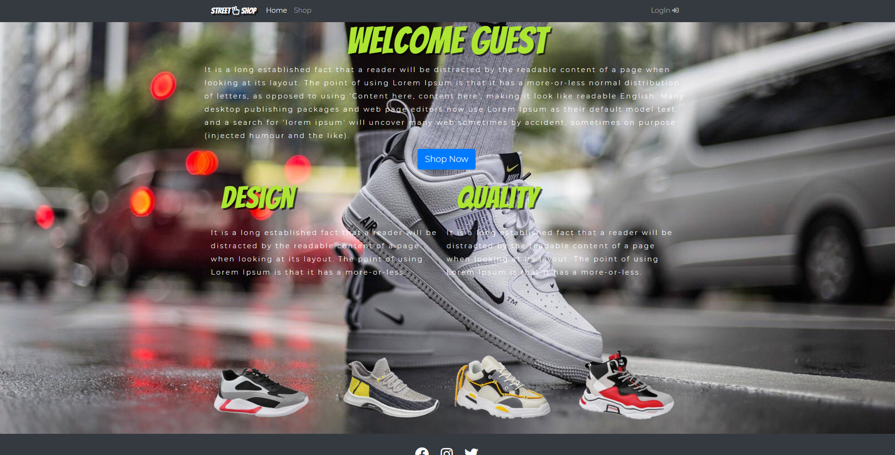
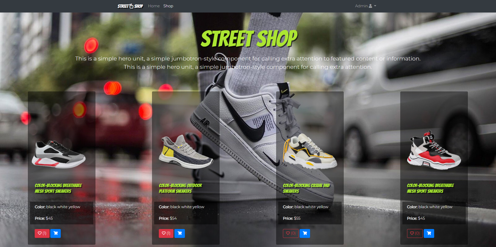
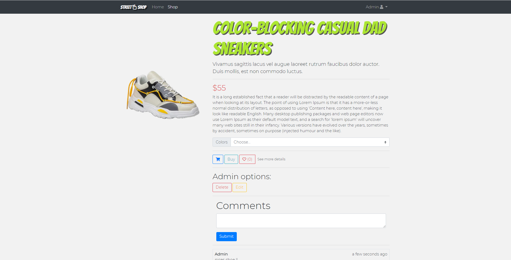
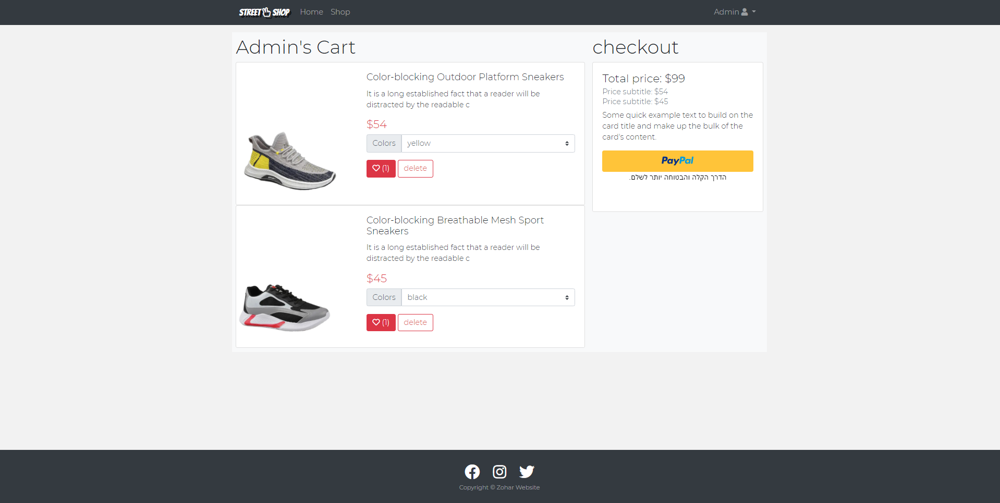
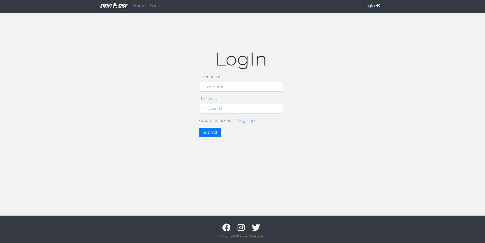
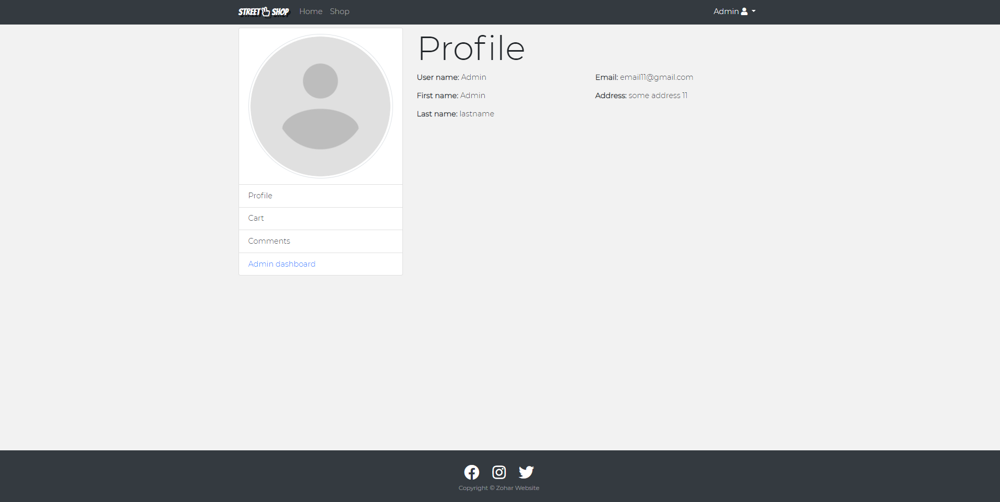
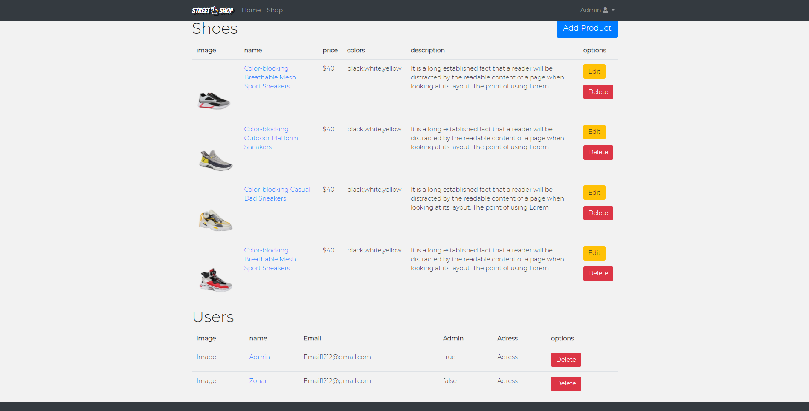
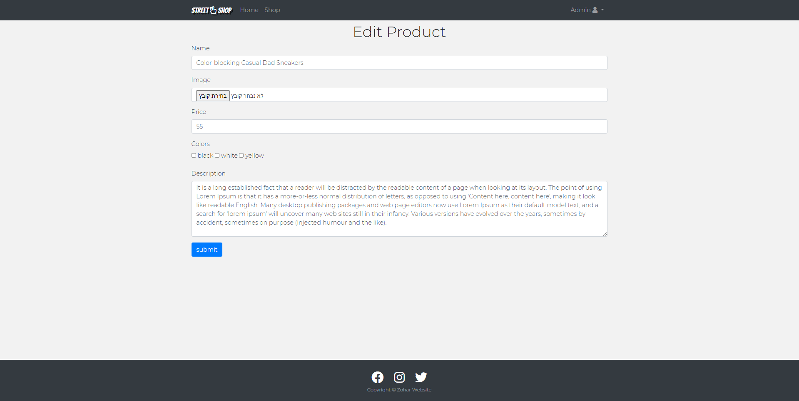

# Street Shop

> eCommerce platform built with Nodejs & MongoDb.











## Technologies & Tools

### Front-end:

* EJS
* JS
* Bootstrap

### Backend:

* Node/Express
* MongoDB/Mongoose
* Passport
* multer


## Features

- Full featured shopping cart
- Errors and success pop-up messages
- Product reviews and likes
- Images upload from pc
- Product pagination
- User profile
- Admin product management
- Admin user management
- Checkout process (payment method)
- PayPal / credit card integration
- Database seeder (products)


## Usage

### Env Variables

Create a .env file in the root and add the following

```
MONGODB_URI = your mongodb uri
EXPRESS_SECRET = 'abc123'
CLOUDINARY_CLOUD_NAME = your cloudinary cloud name
CLOUDINARY_KEY = your cloudinary key
CLOUDINARY_SECRET_API = your cloudinary secret api key
```

### Install Dependencies (frontend & backend)

```
npm install
```

### Run

```
# Run on port :3000
node app.js
```
